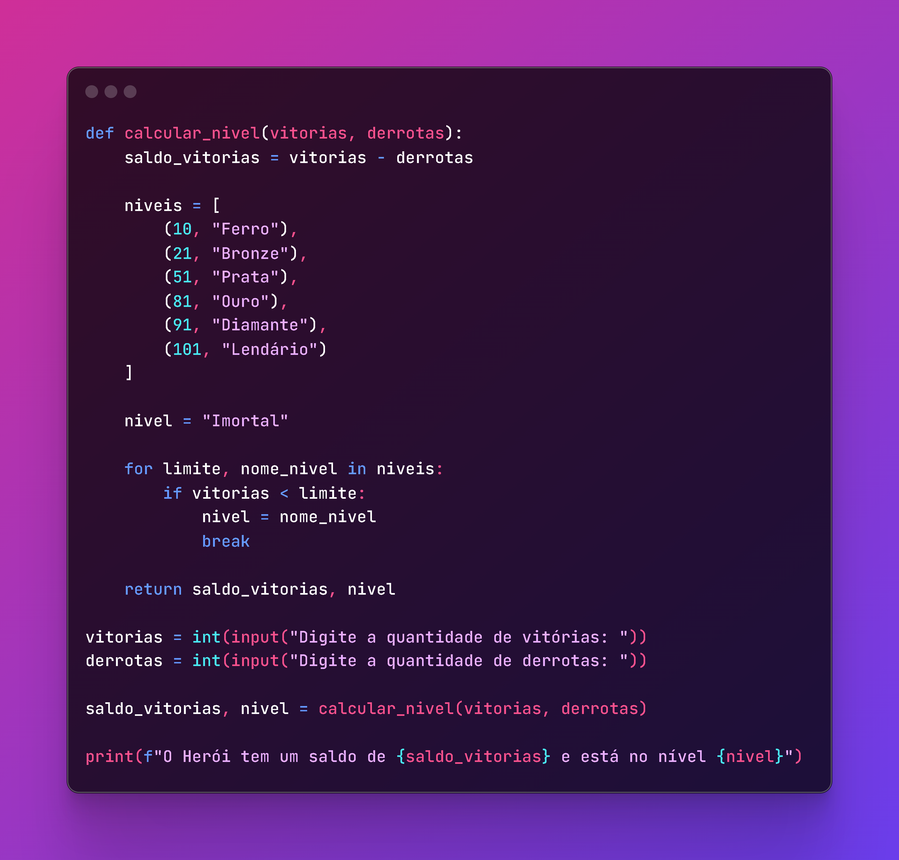

# Partidas Ranqueadas

## 📒 Descrição
Código para definir o ranque do jogador utilizando os dados inseridos sobre quantidade de derrotas e vitórias

## 📜 Instruções

```
**O Que deve ser utilizado**

- Variáveis
- Operadores
- Laços de repetição
- Estruturas de decisões
- Funções

## Objetivo:

Crie uma função que recebe como parâmetro a quantidade de vitórias e derrotas de um jogador,
depois disso retorne o resultado para uma variável, o saldo de Rankeadas deve ser feito através do calculo (vitórias - derrotas)

Se vitórias for menor do que 10 = Ferro
Se vitórias for entre 11 e 20 = Bronze
Se vitórias for entre 21 e 50 = Prata
Se vitórias for entre 51 e 80 = Ouro
Se vitórias for entre 81 e 90 = Diamante
Se vitórias for entre 91 e 100= Lendário
Se vitórias for maior ou igual a 101 = Imortal

## Saída

Ao final deve se exibir uma mensagem:
"O Herói tem de saldo de **{saldoVitorias}** está no nível de **{nivel}**"
```



## 🔎 Saiba Mais
- Material desenvolvido com o objetivo de concluir desafios do curso de Godot na plataforma de estudos [dio.me](https://web.dio.me)
- Não contém GUI.

## 💻 Ferramentas utilizadas
- [Python](https://www.python.org/) - Linguagem utilizada para criação do código.
- [VS Code](https://code.visualstudio.com/) - IDE utilizada para facilitação da criação do código
